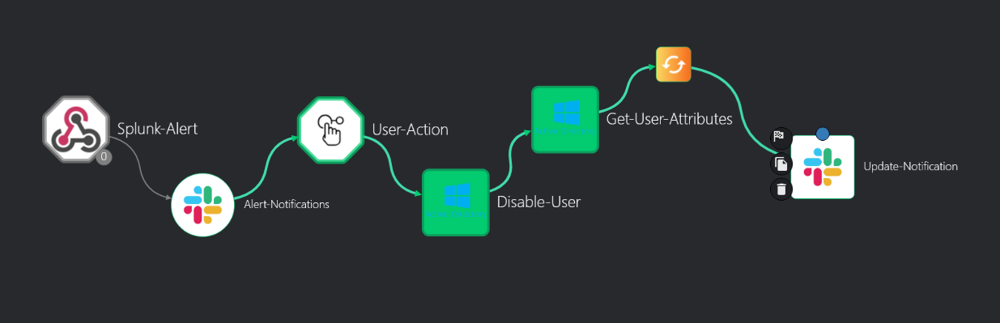
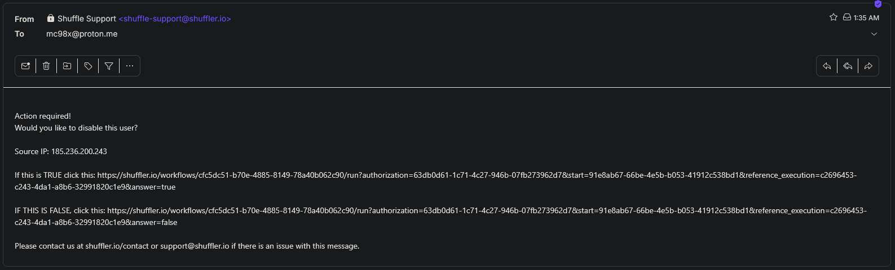
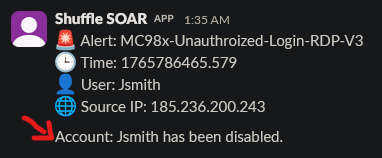

# Active Directory

## Objective
The primary objective of this project was to build a comprehensive **Active Directory environment in the cloud** to simulate a corporate network and gain hands-on experience in **Detection Engineering**, **SOAR**, and **Incident Response**. The goal was to establish a **detection and response pipeline** that identifies unauthorized access (**Suspicious RDP Login**) and utilizes **Shuffle** (SOAR) to automatically **contain the threat** by **disabling the compromised user account**.

---

## Skills Learned

**I. Infrastructure & Identity Management (IAM):**
* **Cloud Network Architecture:** Deployed a **Virtual Private Cloud (VPC)** in **Vultr** to host a **Windows Server 2022 Domain Controller** and a **Windows 10 Client**, configuring internal networking to simulate a corporate LAN.
* **Active Directory Administration:** Promoted a server to a **Domain Controller (DC)**, configured **DNS**, managed **Organizational Units (OUs)**, and created User Accounts to mimic a realistic organizational structure.
* **Endpoint Configuration:** Successfully **joined client workstations to the domain** and enabled **Remote Desktop Protocol (RDP)**.

**II. Detection Engineering (SIEM):**
* **Log Ingestion Pipeline:** Installed and configured **Splunk Enterprise** on a Linux server and deployed **Universal Forwarders** on Windows endpoints to ship **Windows Security & System Logs**.
* **SPL (Search Processing Language):** Developed **custom Splunk queries** to filter out noise and specifically identify **Event ID 4624** (Successful Logins) originating from unauthorized, external IP addresses.
* **Alert Configuration:** Tuned Splunk alerts to trigger **near real-time notifications** based on specific threshold logic.

**III. Security Orchestration, Automation, and Response (SOAR):**
* **Webhook Integration:** Established a listener in **Shuffle** to receive alerts directly from **Splunk**.
* **Active Directory Integration:** Authenticated **Shuffle** with the **Active Directory** environment, allowing the **SOAR platform** to perform administrative actions (**disabling accounts**) remotely.
* **Human-in-the-Loop Logic:** Designed a **decision tree** in Shuffle that sends an **approval request** to the **SOC Analyst** (via Email/Slack) before taking remediation actions, preventing accidental lockouts.

**IV. Threat Simulation:**
* **Adversary Emulation:** Simulated an **external attacker** gaining network access by authenticating via **VPN** from an unknown/external IP address to generate valid **Event ID 4624** telemetry.
* **Telemetry Verification:** Validated that the source IP and login patterns were correctly captured by **Windows Security Logs** and indexed by **Splunk** as a distinct anomaly.

---

## Tools Used

**Security Operations Stack:**
* **Splunk Enterprise:** **SIEM** for log aggregation and searching.
* **Shuffle:** **SOAR** platform for workflow automation.
* **Splunk Universal Forwarder:** Endpoint log collection agent.

**Infrastructure & Environment:**
* **Vultr:** **Cloud Service Provider** (Hosting the Lab).
* **Windows Server 2022:** **Domain Controller** (Target).
* **Windows 10:** Client Workstation (Endpoint).
* **Ubuntu:** Hosting the Splunk Server.

**Utilities & Communication:**
* **PowerShell:** Used for AD setup and connectivity testing.
* **Slack:** Used for **instant incident notification**.
* **RDP (Remote Desktop):** Protocol used for administration and attack vector.
* **Draw.io:** Used for **network diagramming**.

---

## Network Diagram

*This diagram illustrates the logical flow of data and control across the security environment. It shows the **Vultr Virtual Private Cloud (VPC)** segmenting the Domain Controller (DC) and Client from the central security servers. The telemetry flow (Windows Logs/4624) is shown moving from the Endpoints/DC to **Splunk (SIEM)** via the **Universal Forwarder**. The **Shuffle (SOAR) platform** receives the alert via a webhook, and its API connection to the **Active Directory** enables the automated containment action.*

*(Placeholder: Insert your draw.io network diagram here showing the Vultr VPC, the DC, the Client, and the Splunk/Shuffle connections)*

---

## Key Results

**1. Automated Containment of Compromised Users**
By integrating **Shuffle** with **Active Directory**, I created a functional, real-time mechanism where a confirmed threat triggers a direct response. After analyst approval, the workflow automatically **disables the user account** in the Domain Controller and provides a **final confirmation notification** stating which user was contained, closing the incident loop.

**2. Telemetry Visibility & Ingestion**
Successfully established a complete data pipeline where **Windows Security Logs** are generated on the endpoint, forwarded to the Indexer, and visualized in the **Splunk Dashboard**.

**3. Drastic Reduction in Response Time (MTTR)**
The automation workflow transformed the account lockout process from a manual administrative task to a **one-click operation**.

* **Without Automation:** Analyst sees alert -> Manual login and disable. **(~10-15 Minutes)**
* **With Automation:** Analyst receives **Slack Notification** -> Clicks "**Approve**" in email -> Shuffle **API disables the account instantly** and **confirms the action in Slack**. **(< 1 Minute)**

---

## Screenshots

### 1. The Detection: Splunk Query
*I used a custom **SPL query** to filter for **Event ID 4624** (Successful Logon) and exclude expected internal IP ranges. The search results successfully identify the anomalous login by user **Jsmith** from the external **Source IP (185.236.200.243)**, triggering the automation workflow.*

### 2. The Orchestration: Shuffle Workflow
*This node graph represents the complete **SOAR playbook**. The workflow begins with the **Splunk Alert**, immediately sends an **Alert-Notification** to Slack, and then implements a **User-Action** decision gate. Upon approval, it executes the **Disable-User** action in **Active Directory** and confirms the action via **Update-Notification**.*

### 3. The Triage: Slack Alert and Email Approval
*The system uses Slack for **immediate, high-visibility alerting** (displaying the user Jsmith and the suspicious IP). The **Email** serves as the **Human-in-the-Loop** step, providing the analyst with links to either approve or deny the remote action, ensuring proper vetting before containment.*

### 4. The Response: Final Confirmation and Disabled Account
*This demonstrates the closed-loop success of the automation: **Part A** (bottom image) shows the final Slack message confirming that **Account: Jsmith has been disabled**. **Part B** (top image) provides the visual validation within **Active Directory Users and Computers**, showing the user object for Jenny Smith is still present but now contained.*

---

## Future Improvements

To further evolve this Active Directory project, the following enhancements are planned:

* **Geo-Location Blocking:** Enhance **detection rules** to automatically flag or block IPs based on geographic location using a plugin in Splunk.
* **Kerberoasting Simulation:** Expand the attack scope to include internal **AD attacks** like Kerberoasting to test detection capabilities against **credential theft**.
* **Vulnerability Scanning:** Introduce **Nessus** to scan the Domain Controller for misconfigurations or unpatched vulnerabilities.
* **Report Generation:** Configure Splunk to email a weekly PDF report summarizing all security events to management.
* **MITRE ATT&CK Mapping:** Map all custom detection rules to the **MITRE ATT&CK framework** for coverage analysis.

---

## Conclusion

This **Active Directory project** demonstrates a comprehensive understanding of securing an enterprise's **Identity Provider**. By simulating a real-world attack scenario and building a response mechanism that bridges the gap between the **SIEM** (Detection) and **Active Directory** (Remediation), I have proven that I can not only monitor a network but **actively defend it**.

This project proves my ability to:
1. **Deploy and manage** Windows Server and Active Directory infrastructure in the cloud.
2. Write **custom SPL** to extract meaningful security insights from raw logs.
3. **Architect automated workflows** that reduce the workload on SOC teams and minimize the **dwell time** of attackers, directly translating to improved **Mean Time to Respond (MTTR)**.

These skills are **essential for a modern SOC Analyst**, enabling me to contribute immediately to **threat detection** and **incident response** operations.

---

## Resources and Documentation

To review the full build process and configuration details

* **Complete Process Screenshots:** [Full Screenshot Process (Link to your blog/detailed step-by-step document)](to add..)
