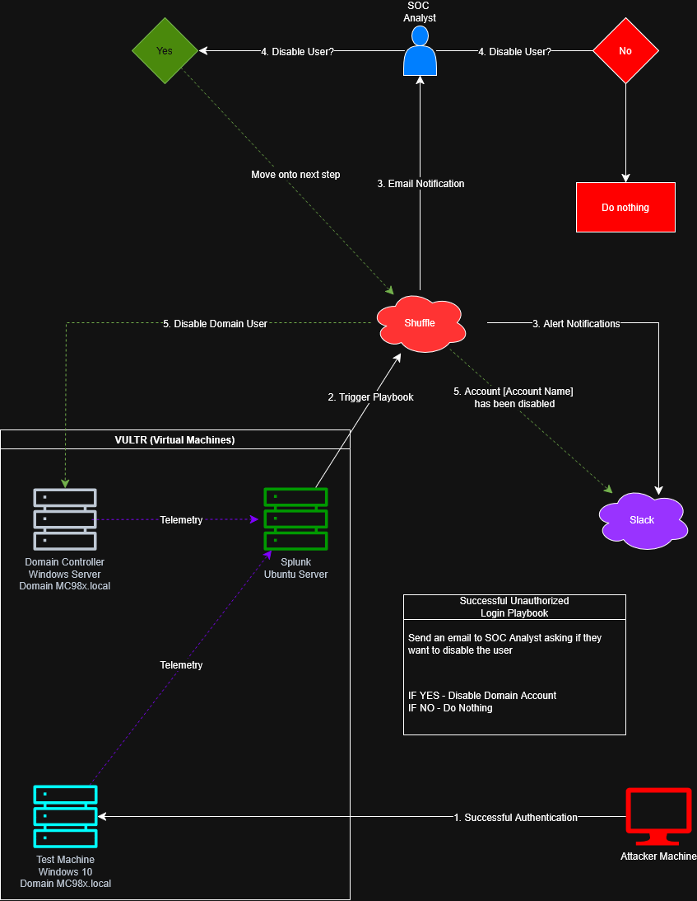
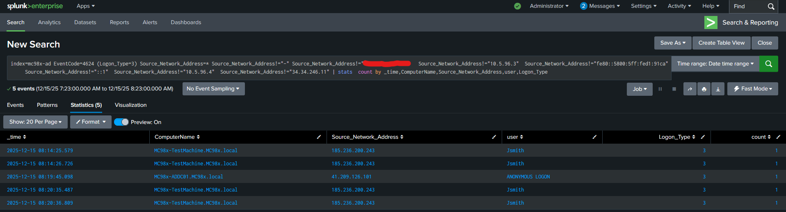
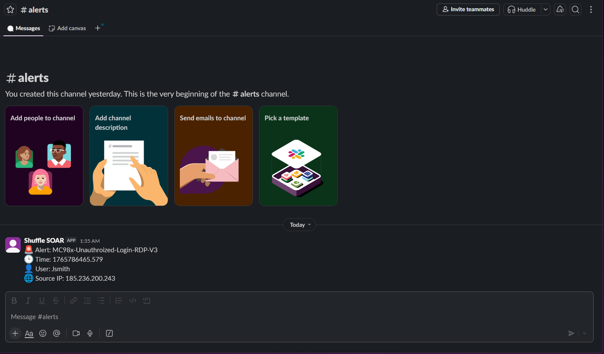
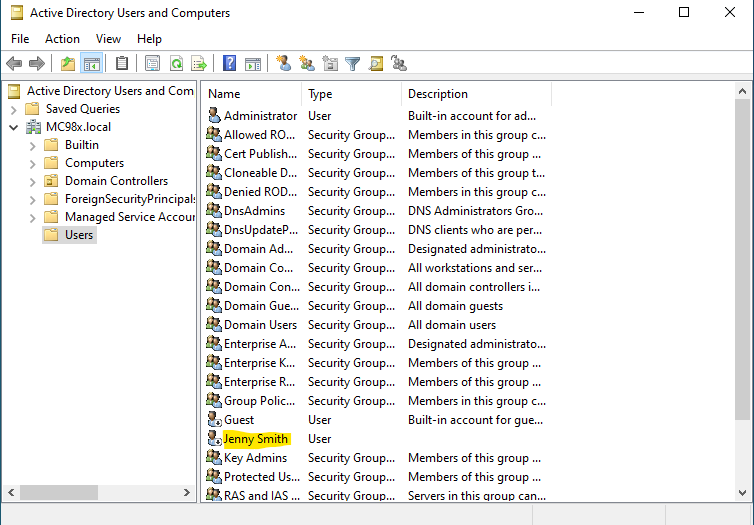

# AD Login Detection + Auto-Containment (Splunk + Shuffle)

**One-liner:** Built a Splunk + Shuffle workflow to detect anomalous **4624** logons (external IP/RDP) and trigger approved **AD account disablement**, reducing containment to **<1 minute**.

**Stack:** Splunk (SIEM) • Shuffle (SOAR) • Active Directory (AD DS) • Windows Server 2022 • Universal Forwarder • Vultr (VPC) • Slack/Email  
**Use case:** Suspicious RDP login → detect in Splunk → notify analyst → approve → disable user in AD

## What I Built (Flow)
1. Deployed a cloud **Active Directory** lab in **Vultr VPC** (Windows Server 2022 DC + Windows client).
2. Shipped **Windows Security logs** to **Splunk** using **Universal Forwarders**.
3. Wrote **Splunk SPL** to detect anomalous **Event ID 4624** logons from **external IPs** (RDP).
4. Triggered **Shuffle** via webhook to send **Slack/email** alerting.
5. Implemented **human approval** before running automated containment (**Disable-AD-User**), then posted confirmation.

## Outcomes (Measurable)
- **Containment:** **<1 minute** from alert → approved account disablement  
- **Reduced manual effort:** replaced “log in + disable user” with a controlled one-click workflow  
- **Improved visibility:** clear audit trail via ticket/notifications + confirmation message

## Screenshots / Evidence

### Workflow Diagram

### Detection (Splunk SPL / 4624)

### SOAR Orchestration (Shuffle)

### Analyst Triage (Slack + Approval)

### Response Confirmation (AD Disable + Slack Closeout)

## Skills Demonstrated
- **Detection Engineering (Splunk SPL / Windows Security Logs)**
- **SOAR Automation (Shuffle)**
- **Identity & Access Management (Active Directory)**
- **Incident Response (containment + comms)**
- **Webhook / API Integration**

## Next Improvements
- Add enrichment (GeoIP, allowlisted ranges, known admin sources) to reduce false positives.
- Expand detections to AD attack paths (Kerberoasting / lateral movement) with additional event correlations.
- Add case management integration to track approvals and remediation steps end-to-end.

## Resources
- **Complete Process Screenshots:** [Full Screenshot Process](./full-screenshot-process)
